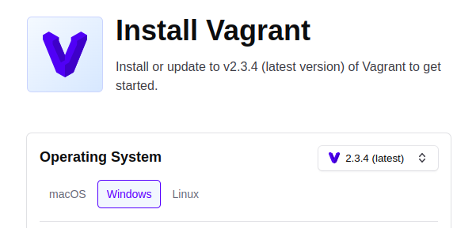
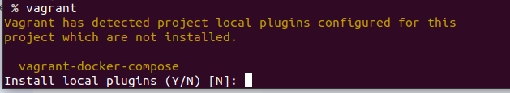
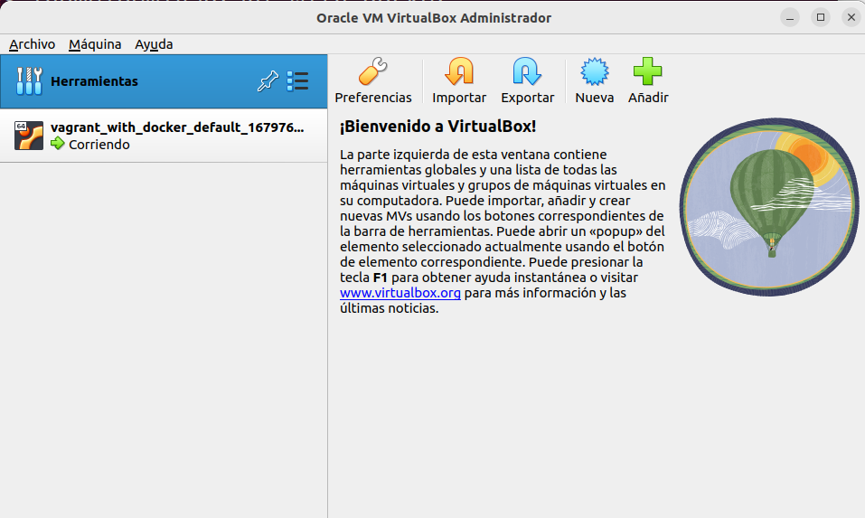
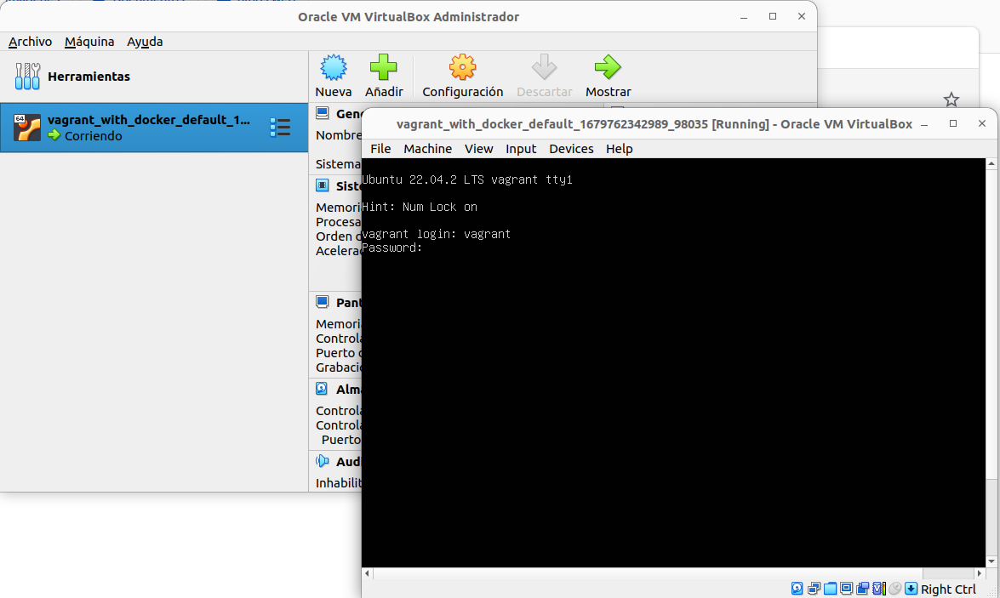

# Objetivo
Tener todos una misma máquina donde poder probar los comandos e instrucciones que vayamos viendo de ***[docker](https://www.docker.com/)***.

Para ello vamos a tener una máquina virtual de ubuntu e instalada en ella **[docker](https://www.docker.com/)**.

Para conseguir esto usaremos **[Virutalbox](https://www.virtualbox.org/)** como herramientoa para crear máquinas virtuales y **[Vagrant](https://www.vagrantup.com/)** .
como herramienta que nos va a permitir configurar la máquina virtual e instalar en ella los paquetes que necesitemos, en esta caso **[docker](https://www.docker.com/)**.
## [Virutalbox](https://www.virtualbox.org/)
Este programa permite gestionar máqinas virtuales. En este caso sí que son máquina completas que emulan tanto el software como el hardware (en los contenedores, solo se emula software).
La instalación es mu sencilla, dentro [Virutalbox](https://www.virtualbox.org/)  accedemos a la sección de [descargas](https://www.virtualbox.org/wiki/Downloads), y seleccionamos según nuestro sistema operativo


Ejectuamos el programa y visualizaremos la interfaz gráfica de [Virutalbox](https://www.virtualbox.org/)

------

------

## [Vagrant](https://www.vagrantup.com/)
Este sofrtare, lo que nos va a permitir es realizar uan configuración previa a la máquina que queremos instalar, especificando tanto la máquina, como los paquete que queremos tener instalados.

Esto se consigue mediante un fichero de configuración llamado **Vagrantfile**.

Posteriormente,  para levantar la máquina virtual con el entorno especificado, simplemente hemos de ejecutar el comando:
```shell
vagrant up
```
 #### Instalando [Vagrant](https://www.vagrantup.com/)

 Para la instalación vamos a la sección [Descargas](https://developer.hashicorp.com/vagrant/downloads), y seleccionamos el SO que tengamos en nuestra máquina.

-----
 
-----
Una vez instalado, y para verficarlo, simplemente escribimos en un terminal 
```shell
vagrant up
```
Y nos aparecer una serie de preguntas para el proceso de su ejecución

-----
 
-----

## Crear en entorno de desarrollo
Una vez que lo tenemos todo instalado, simplemente ejecutamos vagrant con el fichero de configuración que se aporta en este git ***[Vagrantfile](./Vagrantfile)***
```shell
% vagrant up
```
 
Si durante la instalación tienes problemas, puedes probar a arrancar virtualbox y eliminar la máquina que se ha generado para que la vuelva a generar
 
------
 
 -------

También suele ocurrir un error 
 default: Warning: Authentication failure. Retrying...
(es un tema de claves publica y privada)pero al final sí que entra bien.

Una vez dentro, arrancamos [virtualbox](https://www.virtualbox.org/) y entramos en la máquina virtual

Presionamos el botón **Mostrar** y nos saldrá un **terminal**

Nos pide credenciales, e insertamos ***vagrant*** tanto para *login*  como para *password*

____

____

Una vez dentro, vemos que ya tenemos instalado [docker]() y lo podemos ejecutar con normalidad

Para volver a la máquina principal, al host, simplemente presionalmos el **Ctrl** del teclado que está a la derecha.
Para poder ejecutar en pantalla grande el terminal vamos al menú de la máquina virtual en la opción **Devices** seleccionamos ***Update Guest Addition***