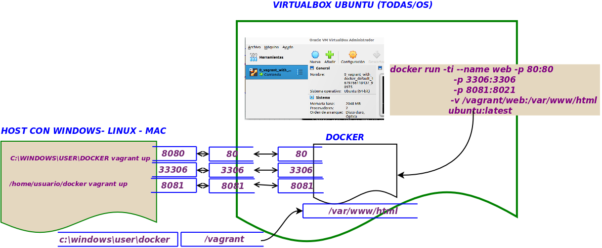

# Objetivo
Tener todos una misma máquina donde poder probar los comandos e instrucciones que vayamos viendo de ***[docker](https://www.docker.com/)***.

Para ello vamos a tener una máquina virtual de ubuntu e instalada en ella **[docker](https://www.docker.com/)**.

Para conseguir esto usaremos **[Virutalbox](https://www.virtualbox.org/)** como herramientoa para crear máquinas virtuales y **[Vagrant](https://www.vagrantup.com/)** .
como herramienta que nos va a permitir configurar la máquina virtual e instalar en ella los paquetes que necesitemos, en esta caso **[docker](https://www.docker.com/)**.
## [Virutalbox](https://www.virtualbox.org/)
Este programa permite gestionar máqinas virtuales. En este caso sí que son máquina completas que emulan tanto el software como el hardware (en los contenedores, solo se emula software).
La instalación es mu sencilla, dentro [Virutalbox](https://www.virtualbox.org/)  accedemos a la sección de [descargas](https://www.virtualbox.org/wiki/Downloads), y seleccionamos según nuestro sistema operativo


Ejectuamos el programa y visualizaremos la interfaz gráfica de [Virutalbox](https://www.virtualbox.org/)

------

------

## [Vagrant](https://www.vagrantup.com/)
Este sofrtare, lo que nos va a permitir es realizar uan configuración previa a la máquina que queremos instalar, especificando tanto la máquina, como los paquete que queremos tener instalados.

Esto se consigue mediante un fichero de configuración llamado **Vagrantfile**.

Posteriormente,  para levantar la máquina virtual con el entorno especificado, simplemente hemos de ejecutar el comando:
```shell
vagrant up
```
 #### Instalando [Vagrant](https://www.vagrantup.com/)

 Para la instalación vamos a la sección [Descargas](https://developer.hashicorp.com/vagrant/downloads), y seleccionamos el SO que tengamos en nuestra máquina.

-----
 
-----
Ahora debemos de actualizar el path, para que podamos ejectutar vagrant en la línea de comandos
>  System Properties -> Advanced -> Click Environment Variables (podemos escribir paht en la búsqueda de windows y saldará la opción)
>  Seleccionamos variables de entorno y hacemos Click en añadir, escribiendo   C:\HashiCorp\Vagrant\bin (Asegurar el path que sea ahí donde está vagrant)
>  Cerramos la ventana y la volvemos a abrir para que se cargue los valores de la variable
> 
Ahora escribimos
```shell
vagrant init
vagrant up
```
Y nos aparecer una serie de preguntas para el proceso de su ejecución

-----
 
-----

## Crear en entorno de desarrollo
Una vez que lo tenemos todo instalado, simplemente ejecutamos vagrant con el fichero de configuración que se aporta en este git ***[Vagrantfile](./Vagrantfile)***
```shell
% vagrant up
```
 
Si durante la instalación tienes problemas, puedes probar a arrancar virtualbox y eliminar la máquina que se ha generado para que la vuelva a generar
Es posible que de un error 
```shell
Stderr: 0%...10%...20%...30%...40%...50%...60%...70%...80%...90%...100%
Interpreting \\?\C:\Users\Profesor\.vagrant.d\boxes\bento-VAGRANTSLASH-ubuntu-22.04\202303.13.0\virtualbox\box.ovf...
OK.
0%...E_INVALIDARG
VBoxManage.exe: error: Appliance import failed
......
```
 En este caso el problema es que no  está bien configurado el patho dónde virtual box va a guardar la máqinas
 Para actualizar esta configuración abrimos ***Virtualbox*** y presionamos en en menú seleccionasmos ***Archivos->preferencias***
 Luego modificamos el path a un directorio que exista (por defecto suele estar d:\)
-------


Y volvemos a repetir el proceso, mejor borrar el directorio .vagrant, para que lo genere de nuevo
```shell
c:\users\profesor\ rmdir .vagrant /S
c:\users\profesor\ vagrant up
```


------
 
 -------

También suele ocurrir un error 
 default: Warning: Authentication failure. Retrying...
(es un tema de claves publica y privada)pero al final sí que entra bien.

Una vez dentro, arrancamos [virtualbox](https://www.virtualbox.org/) y entramos en la máquina virtual

Presionamos el botón **Mostrar** y nos saldrá un **terminal**

Nos pide credenciales, e insertamos ***vagrant*** tanto para *login*  como para *password*

____

____

Una vez dentro, vemos que ya tenemos instalado [docker]() y lo podemos ejecutar con normalidad

Para volver a la máquina principal, al host, simplemente presionalmos el **Ctrl** del teclado que está a la derecha.
Para poder ejecutar en pantalla grande el terminal vamos al menú de la máquina virtual en la opción **Devices** seleccionamos ***Update Guest Addition***
Puede ser que no esté instalado el teclado español. Para cambiarlo dentro de la máquina virtual lo configuramos
 
````shell
sudo dpkg-reconfigure keyboard-configuration
````
 Seleccionamos el teclado de 105 teclas
------
)
)

---
El resto de opciones todo por defecto

### Apuntes para docker

Por defecto, vagrant va a hacer que la carpeta desde donde invoquemos ***vagrant up*** será compartida  a la carpeta ***/vagrant*** dentro de la *máquina virtual*.

Ahora lo que tenemos que tener en cuenta es que trabajamos a dos niveles, es decir, cuando creemos un contenedor dentro de la maquina virtual, para ese contenedor, su host el la maquina virtual
Si queremos usar en contenedor desde el host, lo haremos a través de la máquina virtual, para ello tenemos puertos y carpetas compartidas. Ver imagen siguiente:





